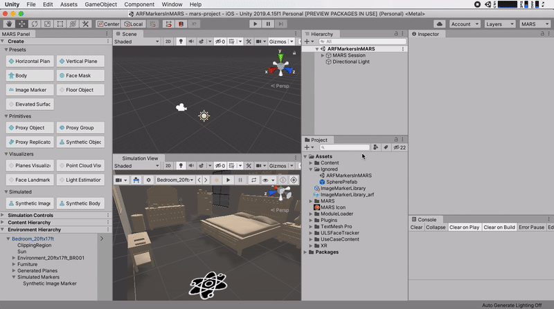
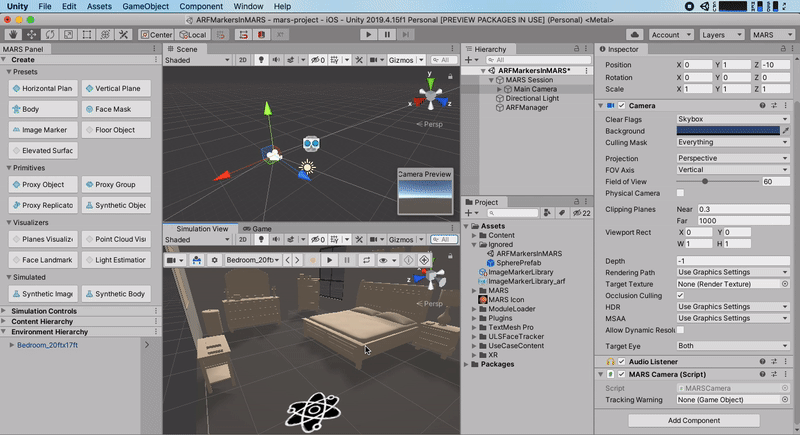

# MARS Simulation as an AR Subsystem
Unity MARS Simulation supports many of the AR Subsystems in AR Foundation. This allows you to leverage the in-editor simulation to reduce development time for your AR Foundation applications.
In this section you will learn how to enable the Unity MARS XR Subsystem, what AR Foundation features are simulatable within MARS and a simple example on how to simulate an AR Foundation image marker.

## XR Subsystem supported features
Not all the features from AR Foundation are supported by the MARS XR Subsystem; in the following table you can see what AR Foundation systems are simulatable in MARS.

|        Feature        | AR Foundation | MARS Simulation subsystem |
| --------------------------- |:-------:|:-----:|
| Device Tracking             |    ✓    |   ✓   |
| Planes                      |    ✓    |   ✓   |
| Point Clouds                |    ✓    |   ✓   |
| Anchors                     |    ✓    |   ✖   |
| Light Estimation            |    ✓    |   ✓   |
| Environment Probes          |    ✓    |   ✖   |
| Faces                       |    ✓    |   ✓*  |
| Image Markers               |    ✓    |   ✓   |
| 3D Object Tracking          |    ✓    |   ✖   |
| Meshes                      |    ✓    |   ✓   |
| Bodies                      |    ✓    |   ✖   |
| Collaborative Participants  |✓ (ARKit)|   ✖   |
| Human Segmentation          |    ✓    |   ✖   |
| Raycast                     |    ✓    |   ✓   |
| Pass-through video          |    ✓    |   ✓** |
| Session management          |    ✓    |   ✖   |
| Occlusion / Depth Image     |    ✓    |   ✖   |

\* Landmarks but no face mesh\
\** Play mode only with AR Camera Background and AR Background Render Feature (URP)

## Activating the XR Subsystem
To activate the XR Subsystem to simulate AR Foundation content, follow these steps:

1. From Unity's main menu, go to **Edit &gt; Project Settings.** 
2. Select the **XR Plug-in Management** section.
3. In the PC, Mac & Linux Standalone settings tab, select MARS Simulation.

**NOTE:** It is important to check that no other providers (checkboxes) are selected since when entering Play mode in the editor, Unity will use the first selected provider in the list.

## Simulating AR Foundation image markers
This section will present how to create an AR Foundation image marker that, when detected by the MARS XR simulation Subsystem, will place a 3D Sphere where the AR Foundation marker is located.

### Setting up the simulation environment
First, make sure you [activate the XR Subsystem](MarsSimulation.md#activating-the-xr-subsystem) so AR Foundation features work when simulating in Unity MARS.

After the XR subsystem is set:
1. Open the simulation view by going to **Window &gt; MARS &gt; Simulation View**
2. [Create a synthetic image marker](https://docs.unity3d.com/Packages/com.unity.mars@latest/index.html?subfolder=/manual/Markers.html%23adding-synthetic-markers-to-environments) from the [MARS Panel](https://docs.unity3d.com/Packages/com.unity.mars@latest/index.html?subfolder=/manual/GettingStarted.html%23overview-of-the-unity-mars-ui) and place it in the environment.
3. Add a [marker library](https://docs.unity3d.com/Packages/com.unity.mars@latest/index.html?subfolder=/manual/Markers.html%23creating-a-marker-library) to the synthetic image marker and select an image you want to track.

**NOTE:** MARS will create an AR Foundation Marker Library along with a MARS Marker Library. You will be using the AR Foundation Marker Library for the marker logic.

### Setting up an AR Foundation Image Marker

Now that the environment to simulate the marker is set up, you can start creating the AR Foundation marker logic.

1. Create an empty GameObject that will contain the AR Foundation managers.
2. Attach an `AR Session Origin` component and set the _Camera_ reference.
3. Attach an `AR Tracked Image Manager` component and fill the _Reference library_ reference with the created AR Foundation library and attach a prefab (in this case a simple sphere prefab) in the _Tracked Image Prefab_ field.

### Testing the image marker in the MARS Simulation subsystem
By now you are ready to test the AR Foundation image marker. Press play and move with the _W A S D_ keys while holding the right mouse button to move around. Look at the created marker and you will see a sphere spawn on top of it.

If prompted to save the simulated environment, save it. This will save the changes that you made when creating and setting the synthetic image marker.

**NOTE:** The XR Subsystem will only work in Editor Play Mode and not with the simulation view play button.
