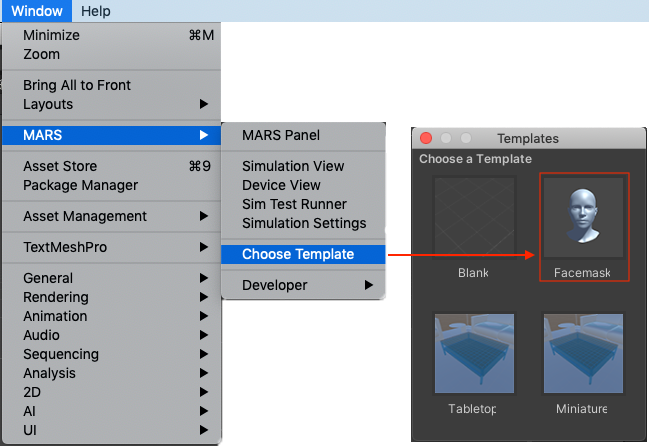
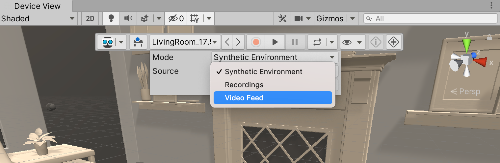
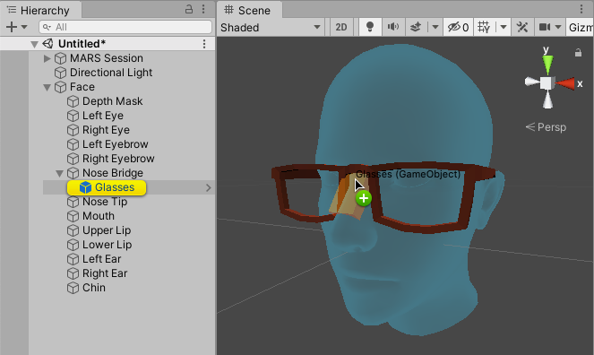
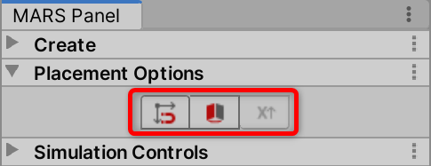
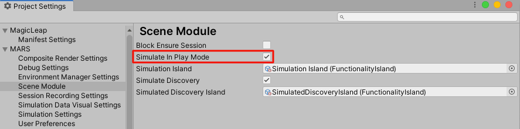

# Face tracking

Face tracking is an important part of AR with many practical use cases, including face effects, filters, and "try-ons" which allow the user to simulate makeup, eyeglasses, or different hairstyles.

Unity MARS applications have face-tracking ability when you deploy your app to an Android or iOS device. In the Unity Editor, Unity MARS applications can use face tracking in **Recorded** mode simulations. The Unity MARS package content includes default [Session Recordings](SessionRecordings.md) that are videos with pre-recorded face tracking data. You can play these videos in **Recorded** mode to test against recorded face data.

AR Foundation face tracking might support some features that Unity MARS doesn't include. You can use both Unity MARS and AR Foundation APIs in the same scene to achieve your project needs.

## Using a facemask template

From Unity's main menu, go to **Window &gt; MARS &gt; Choose Template**, and select the **Facemask** option. This opens a template Scene with all the elements you need to incorporate face tracking in your app.

To test out face tracking capabilities while designing your AR app, make sure that the Simulation view is open, and set its mode to **Recordings**.

## Placing digital content on a face

The Facemask template places a head model in the middle of your Scene.

To create facemasks, decorate this model as if it were a mannequin. When you drag a Prefab from your Project onto the face, different key ‘landmarks’ (such as the eyebrow or nose) light up as the cursor hovers that area. Release the mouse button to anchor the GameObject to that particular feature. Unity MARS places the GameObject as a child GameObject of the face landmark in the **Transform** hierarchy.

To reposition a Prefab or move it to a different landmark, select the GameObject, hold down the Shift key, and then drag the GameObject to its new position.

To control how dragged GameObjects should snap and align to the face, use the **Placement Options** section of the main Unity toolbar. The options available are **Snap to Pivot** and **Orient to Surface**. If you enable **Orient to Surface**, you can also select which direction Unity considers to be "forward".

**Note:** If you are not using Unity 2019.3 or 2019.4, these options don't exist in the main toolbar; instead, they are in the MARS Panel's **Placement Options** section.

## Testing face tracking on Unity MARS

To test your facemask in the Device view, set the **Mode** to Recordings, and set **Source** to one of the video options.

To test your face tracking app in Play mode, you must enable the **Simulate in Play Mode** option in Project Settings. From Unity's main menu, go to **Edit &gt; Project Settings &gt; MARS &gt; Simulation &gt; Scene Module &gt; Simulate in Play Mode**.

