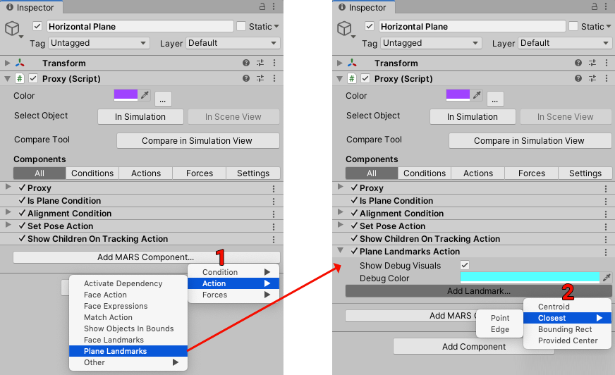
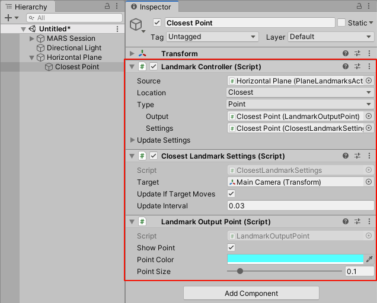
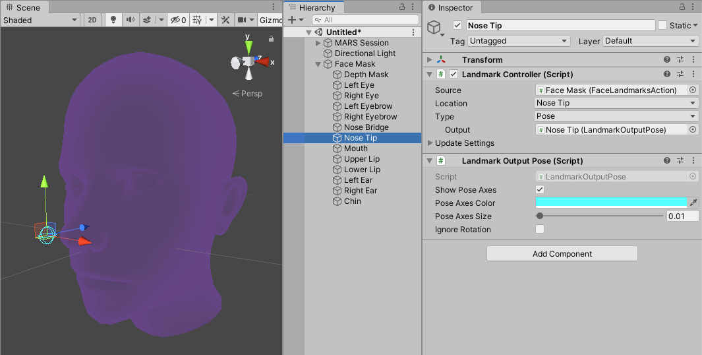
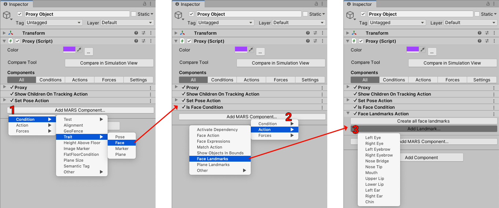

# Landmarks
Landmarks are spatial data such as points, edges, or polygons, that break down data from the real world into useful parts for anchoring or aligning virtual content. For example, on faces, the eyes, mouth, and ears are landmarks, and a detected AR plane has a polygon surface and a bounding rectangle. In both cases, you want to connect your virtual content to a landmark instead of the center point of the detected face or plane.

In this section we are going to cover all the different **Landmarks** available in Unity MARS, how to use scripts to access landmarks and finally how to define your own custom landmarks

## Adding landmarks to Unity MARS objects
Use Actions to add landmarks. You can add landmarks to faces, planes, and several other types of data.

You can also build and configure landmarks through the [Rules workflow](Rules.md).

### Landmarks on planes
You can add plane landmarks to Proxies that have plane Conditions (such as `IsPlaneCondition` or `PlaneSizeCondition`). To do this, from the Proxy's Inspector window, click the **Add MARS Component** button, then select **Action &gt; Plane Landmark** (1).



On the Inspector for that Action, click the **Add Landmark** button (2) and choose one option from the dropdown menu. This creates a new GameObject as a child of the currently selected Proxy, based on the option you selected. Select the newly created Landmark and edit it in the Inspector.



### Landmarks on faces
For face tracking landmarks, you can start with the Face prefab that has its landmarks already set up (located in `MARS/Runtime/Prefabs/FaceMask.prefab`). Right-click the prefab to unpack it (from the context menu, select **Unpack prefab completely**). Attach your content to the child transforms for each feature of the face.  Then, you can delete the ones your app isn't using, or duplicate existing ones and change the settings in the Inspector.



Instead of using this prefab, you can add face landmarks to a Proxy. To start, add an **Is Face** trait to the Proxy (1), then add a **Face Landmark** action (2) and click the **Add Landmark** button, as shown in the screenshot below (3).



### Landmarks on bodies
**Landmarks** are also available with [**Body Tracking**](BodyTracking.md), from the *Create Menu -> MARS -> Presets -> Body*. You can attach gameobjects to landmarks on the body the same way you can with landmarks on faces, by parenting them to the **landmark** in the **Hierarchy** or *Drag and Dropping* them on the visualizer for the landmark in the **Scene View**. For more information about landmarks in bodies please refer to the [landmarks section in the bodies documentation](BodyTracking.md#body-landmarks).

### Other types of landmarks

You can also use landmarks in other types of scenarios. To add other types of landmarks, add a **Landmark Controller** component to a GameObject (either new or existing), and set the **Source** property to a component that implements `ICalculateLandmarks` such as `PlaneLandmarksAction`, `FaceLandmarksAction`, or `LandmarkOutputPolygon`.

**Note:** The **Plane Landmarks** and **Face Landmarks** actions only get data if they are placed directly on the Proxy object or one of the Proxy's child objects.

Multiple landmarks can reference a single action and share the source data. In this case, you can place the Landmark Controller anywhere in the hierarchy, as long as it references the action.

## Landmark scripts

The following scripts are used for working with landmarks: `LandmarkController`, `LandmarkOutput`, `LandmarkSettings`, and `LandmarkSource`. Depending on your needs, you can have all or some of the scripts attached to your GameObjects.

### LandmarkController

The `LandmarkController` script references the other components (source, settings, output) and controls when (but not how) the landmark updates.

### LandmarkOutput

The `LandmarkOutput` script contains the resulting landmark data and uses it to affect the Scene. The standard landmark output types (such as point, edge, etc.) modify the Transform component, draw gizmos, and have public properties accessible via scripting.

Each type of landmark output implements `ILandmarkOutput` and adds specific data it needs. From a `LandmarkController`, you can access the `.output` property and then cast it to the specific type of output you need. If the property is the wrong type, the cast fails and returns null.

```
public class MyScript : MonoBehaviour {
    public LandmarkController closestEdgeLandmark; // Reference to a landmark

    void Update() {
        var edgeOutput = closestEdgeLandmark.output as LandmarkOutputEdge;
        if (edgeOutput == null)
        {
            // The assigned landmark is not set to type “edge”
        }
        else
        {
            // Do something with the data in edgeOutput, such
            Debug.Log(edgeOutput.startPoint + “ -> “ + edgeOutput.endPoint);
        }
    }
}
```

### LandmarkSettings

Some landmark types need extra input data because they can’t be calculated by just the source. For example, the closest edge of a plane depends on another position in order for MARS to calculate it. If no settings are required, then the `.settings` field of the `LandmarkController` can be null. Otherwise, it references a component that holds the required extra properties. Each settings component implements the interface `ILandmarkSettings` and can trigger the landmark to be recalculated if needed.

### LandmarkSource

The `LandmarkSource` script defines how landmarks are calculated. Each landmark source contains the name, settings component (if needed), and the output types it supports. It also provides methods for calculating the landmarks. The source can be any class that implements the `ICalculateLandmarks` interface.

The **Plane Landmarks** and **Face Landmarks** actions are examples of a Landmark Source that works for particular MARS GameObjects. They are Action components that use `MatchAcquire` events from a Proxy (either on the same GameObject or a parent GameObject) and get some world data from MARS to calculate landmarks. For more information, see the [Glossary](Glossary.md) entries for Proxies and Match events.

The reason that all of these components exist (instead of just one) is that the landmark system is designed to allow you to easily reuse and extend code. Splitting the behaviour into different components allows for some pieces to be changed without having to duplicate all the code.

The `LandmarkController` script is the reusable framework for different kinds of settings and outputs that you might need to calculate. The custom Inspector can be shared amongst all landmarks, even if they're using completely different types of settings and outputs.

From a technical perspective, this is also necessary because a component must know exactly what types of data the fields will be when they're serialized. Also, in order for different landmarks to have different types of data for their settings and outputs, they must be serialized as different component types.

## Defining custom landmarks

To define a custom landmark, follow the steps below.

### Create a landmark source

To create a custom landmark, you must create a landmark source that defines it. To do this, create a component that implements the `ICalculateLandmarks` interface.

The interface requires the `AvailableLandmarkDefinitions` property, where the source returns all the definitions it can calculate. The definition contains the name, output types, and optionally a settings type.

```
 static readonly List<LandmarkDefinition> k_Definitions = new List<LandmarkDefinition>
 {
            new LandmarkDefinition(“Center”, new []{typeof(LandmarkOutputPoint)}),
            new LandmarkDefinition(“Closest”,
                new []{typeof(LandmarkOutputPoint), typeof(LandmarkOutputEdge)},
                typeof(ClosestLandmarkSettings))
 };

public override List<LandmarkDefinition> AvailableLandmarkDefinitions { get { return k_Definitions; } }
```

In the example above, the class returns a list of two definitions:

* The first is called “Center” and is a “Point” that takes no settings.
* The second is called “Closest” and can be either a point or an edge. It requires a settings component to specify the target.

In the `GetLandmarkCalculation()` method, the source must provide an `Action<ILandmarkController>` (a method that returns void and takes a landmark as its only parameter) for the given landmark’s definition. That method can take the `.settings` and `.output` of the landmark, cast them to the types it expects for the definition, and then modify the output appropriately.

```
public override Action<ILandmarkController> GetLandmarkCalculation(LandmarkDefinition definition)
{
    if (definition.name == “Closest”)
       return CalculateClosestLandmark;
    // else if
    //    ... Check for other definitions
    else
       Debug.LogError("Invalid landmark definition");

   return null;
}


void CalculateClosestLandmark(ILandmarkController landmark)
{
    var settings = landmark.settings as ClosestLandmarkSettings;
    if (settings == null)
    {
        //Plane closest landmark is missing valid settings
        return;
    }

    // Do calculations here

    var landmarkPoint = landmark.output as LandmarkOutputPoint;
    if (landmarkPoint != null)
    {
        landmarkPoint.position = closestPoint;
    }

    var landmarkEdge = landmark.output as LandmarkOutputEdge;
    if (landmarkEdge != null)
    {
        landmarkEdge.startPoint = edgeVertA;
        landmarkEdge.endPoint = edgeVertB;
    }
}
```

The interface has a `dataChanged` event that the landmark controller listens to and chooses whether to update. For MARS Proxies, a `MatchUpdate` event fires this event.

### Creating a landmark output

If the landmark you want to define can't be output to one of the provided types (output, point, pose, or edge), you can create a custom type. For example, if a landmark defines its output type as a rotation, you would add this script:

```
public class LandmarkOutputRotation : MonoBehaviour, ILandmarkOutput
{
    // This will get modified by the landmark source calculate method
    public Quaternion rotation { get; set; }

    public override void UpdateOutput()
    {
        // Do something with the rotation
    }

    void OnDrawGizmosSelected()
    {
        // Draw some gizmos to visualize the rotation
    }
}
```

### Creating landmark settings

If the landmark you want to calculate needs extra custom input data, you can use the settings component field. For example, the closest point or edge of a plane has a target reference. The settings component for that looks like this:

```
public class ClosestLandmarkSettings : MonoBehaviour, ILandmarkSettings
{
    [SerializeField]
    Component m_Target;

    [SerializeField]
    bool m_UpdateIfTargetMoves = true;

    [SerializeField]
    float m_UpdateInterval = 0.03f;

    Vector3 m_PreviousPosition;
    Quaternion m_PreviousRotation;
    float m_TimeSinceLastCheck;

    public Component target { get { return m_Target; } set { m_Target = value; } }

    public event Action<ILandmarkSettings> dataChanged;

    void Update()
    {
        CheckIfMoved();
    }

    void CheckIfMoved()
    {
        if (!m_UpdateIfTargetMoves || dataChanged == null || m_Target == null)
            return;

        m_TimeSinceLastCheck += Time.unscaledDeltaTime;
        if (m_TimeSinceLastCheck < m_UpdateInterval)
            return;

        m_TimeSinceLastCheck = 0f;
        var targetTransform = m_Target.transform;
        if (targetTransform.position != m_PreviousPosition ||
            targetTransform.rotation != m_PreviousRotation)
        {
            dataChanged(this);
            m_PreviousPosition = targetTransform.position;
            m_PreviousRotation = targetTransform.rotation;
        }
    }
}
```

Just like the source, the settings component has a `dataChanged` event it can invoke to indicate that something has changed and the landmark needs to react to that change. In the example above, if the target moves, the settings call the event so that the landmark can recalculate the closest points.
