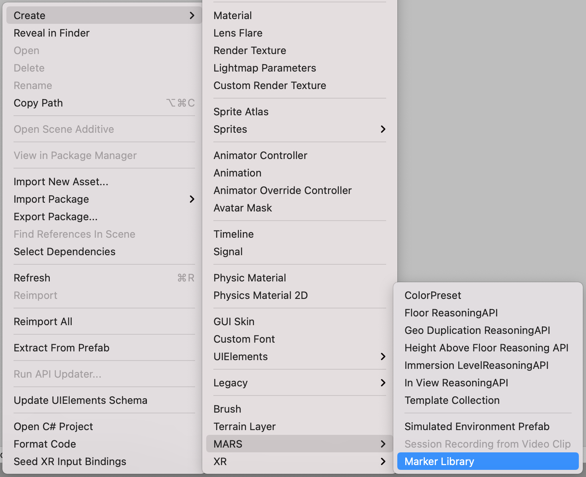
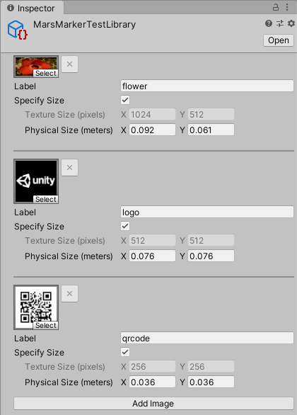
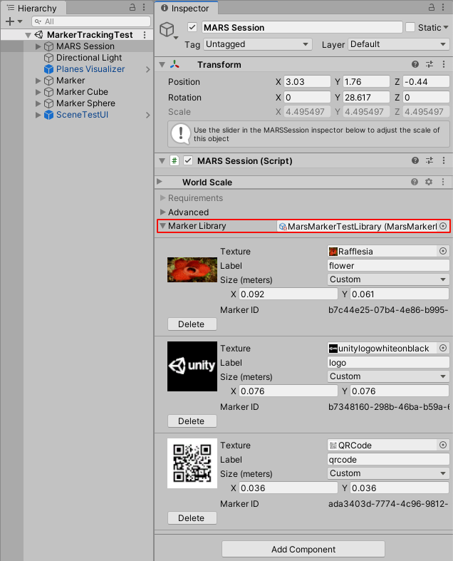
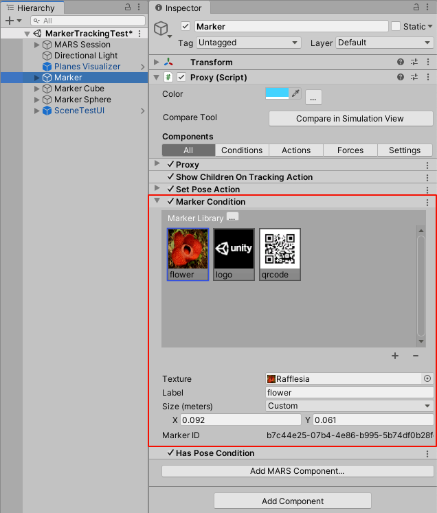
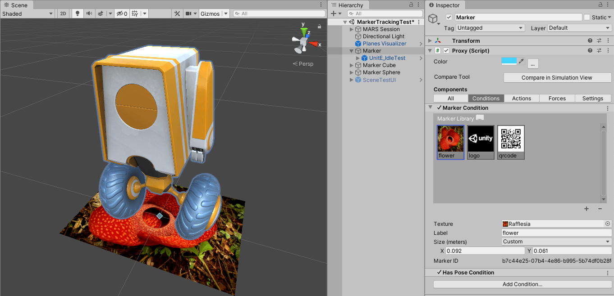
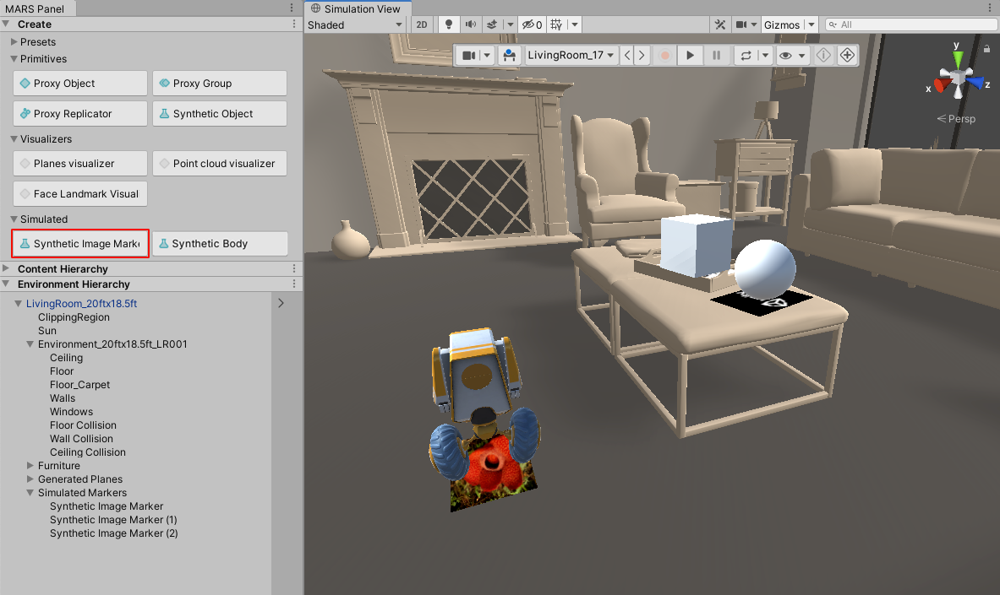
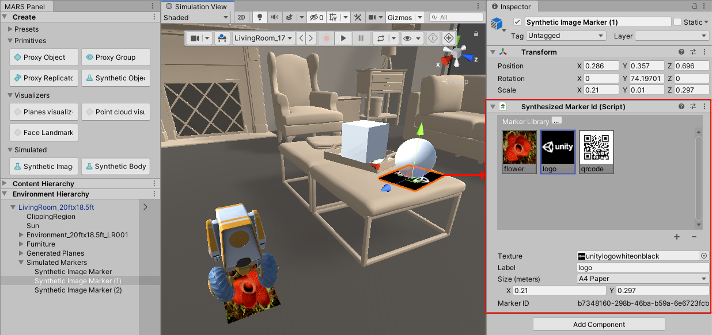
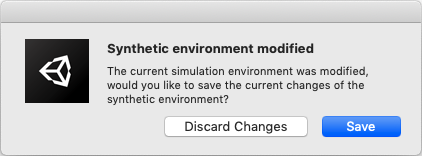
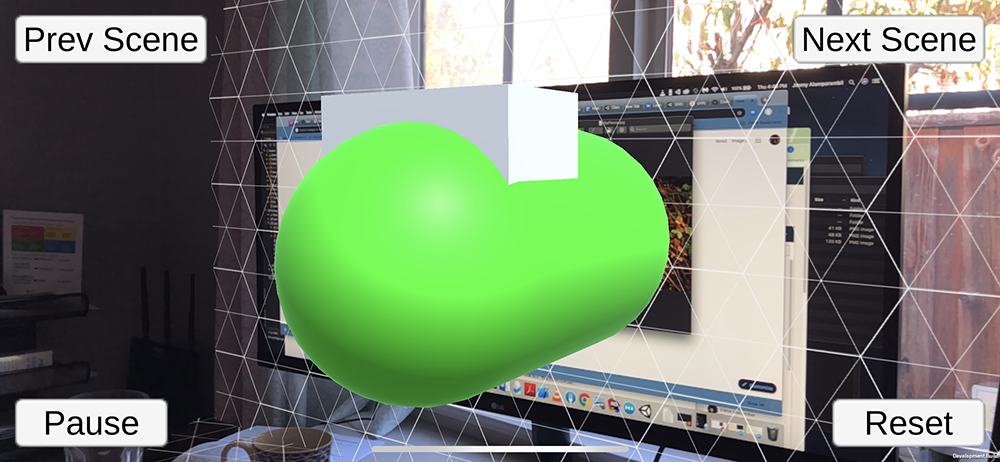

# Image Markers
This guide presents the concepts and workflows for tracking image markers in your application. It shows how to create a marker library and add settings to marker conditions on your proxies. It also includes a real-world example.
After reading this guide, you should have the necessary knowledge to incorporate image markers in your Unity MARS app.

## Marker tracking

Markers offer a useful way to be able to anchor a certain position in a Scene for localization of AR content.
Unity MARS uses the marker tracking features currently exposed via [AR Foundation](https://docs.unity3d.com/Packages/com.unity.xr.arfoundation@3.0/manual/index.html) to allow the creation of content that can detect a marker and align it to its pose.

## Creating a marker library

To start with image marker tracking, you first need a collection of markers (or images), which you must save into a library.
The MARS Session GameObject uses this library to detect any marker specified that appears in the real-world environment that the device is traversing.

To create a library, select a folder in your Project in the Editor, and right-click it to open the Asset creation menu. From this menu, select **Create &gt; MARS &gt; Marker Library**.

This creates a library Asset in the selected Project folder.
In the Asset's Inspector window, you can add entries for each image you want to add to the library.
Each entry needs a reference to an imported image (which the Editor treats as a Texture), and the physical size it should be in the real world. Optionally, you can also add a marker name.

The screenshot below shows an example with 3 entries:

## Using marker libraries

Once you have created your marker library, you can start using it within your Unity MARS application.
To do this, select the MARS Session GameObject in your Scene and look at its Inspector.
The Component has an entry for **Marker Library**. You can drag the reference of the marker library you created above into it to make it the active marker library for that session.

## Marker conditions

Just like everything else in Unity MARS, you need markers to be available to the querying system.
To do this, you need to create a **MarkerCondition** that you attach to a Proxy.
This Proxy contains the content to create at the position of the marker when this condition is satisfied.
Within this **MarkerCondition**, you can select which image marker is going to be linked to the created Proxy that contains the added marker condition.

As you can see, to set up an image marker to the selected Proxy, you must add a **MarkerCondition** to the Proxy, and then click one of the available images loaded from the marker library that you added to the **MARS Session** GameObject.

This example uses a flower as the image marker for this proxy.

When you select an image from the **MarkerCondition**, you can see some information about the selected image marker, such as the **Texture Asset** that it belongs to, a **Label** that you can access to differentiate the marker, and the physical **Size** you want to match this marker against the real world.

Unity MARS provides a set of preset sizes to match your markers, but you can also use custom sizes if you need to.

## Visualizing image markers

When you select an image marker, you can immediately see it in the Scene view and compare its physical size against the 3D objects you have attached to it.

**Note:** If you have a poster-sized image marker and, for example, a cube primitive (1m x 1m x 1m), you might not see the attached GameObject when running the application because you might be inside it.
Always design your experiences keeping in mind the physical size of your GameObjects against the real world.

## Simulating image markers

Unity MARS can simulate image markers in synthetic environments. Simulating image markers lets you assess how your markers behave inside different real-world scenarios and speeds up your iteration time when developing Unity MARS apps that use image markers.

### Adding synthetic markers to environments
To add a synthetic marker to an environment that is currently open, click the __Synthetic Image Marker__ button on the MARS Panel.

When you click this button, Unity MARS creates a __Synthetic Image Marker__ GameObject under the __Environment Hierarchy__. This GameObject serves as a placeholder for matching user-created image markers.

### Manipulating synthetic image markers
After you place a synthetic marker in the environment, you can move and rotate it like any other GameObject.
You set synthetic image markers in the same way as normal image markers: select the marker, then pick the image to use from the currently loaded library.

To save your environment, either change environments or reload the simulated environment. Unity MARS displays a pop-up window asking you if you want to save the current changes.

You can also save changes on your simulated environments; to do this, apply Prefab overrides on the linked environment Prefab, the same way as any other Prefab instance.

__Note:__ If you can't modify GameObjects in your environment, make sure you set your selection mode to **Environment** using the toggle in the Simulation toolbar: 

## Putting it together
The following screenshot shows the sample Scene above, in a location where one of the images in this active marker library has been detected.

