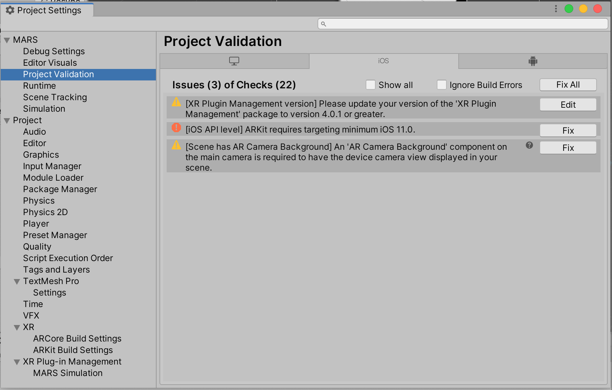

# Project Settings

This page provides more information on the **Unity MARS** Project Settings section found in **Edit &gt; Project Settings**.

## Project Validation

Unity MARS has a built in Project Validation utility that helps you avoid common configuration issues with your scenes and project. The Project Validation is made up of rules that run at build time or in your current scene if the Project Validation Settings is open (**Edit &gt; Project Settings &gt; MARS &gt; Project Validation**).

In the Project Validation window, there are tabs for the Build Target Groups of your project. Selecting a tab will check that Build Target's validation rules on your project without needing to switch build targets. These are the same validation rules that are run at build time for that build target.

Underneath the platform tabs (Standalone, iOS, Android, etc) you will see a listing of the number of issues and checks performed, an option to 'Show All' checks, and, if there are items that can be automatically fixed, a 'Fix All' button.

In the individual build validation check rows you will find a check status icon, the title and summary message about the check, a help icon linking to more information if available, and to the very right either a 'Fix' or 'Edit' button.

### Check status icons

The status icons to the left of an individual build validation rule give more information as to the status of the rule.

| Status | info |
| ----------- | ----------- |
|  | Build validation rule passed: either set up correctly, or not applicable. Build validation Rules that pass are hidden in the Project Settings &gt; Project Validation Window unless 'Show All' is enabled. |
|  | Build validation rule failed, but will not block the building of the project. If you chose to set your project up differently than the recommendation, you can ignore these warnings. |
|  | Build validation rule failed and blocks building of the project. |

### Fix or Edit button

The 'Fix' button will automatically fix the issue in your project or scene. The 'Edit' button will lead you to the appropriate place to correct the issue in your project if the fix setting cannot be applied automatically. Either the 'Fix' or 'Edit' buttons will provide a tooltip explaining the steps to manually correct the issue in your project.
