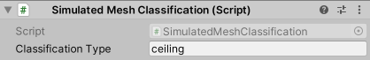

# Simulation Environment Components Reference guide
This section refers to components that are not part of Unity MARS proxies yet they are used in the MARS simulation environments. 
Commonly these components set how the simulation environment is organized.

For reading about components that simulate realworld data in the simulated environments please refer to the [Synthetic Data](ReferenceGuideSyntheticData.md) section.   

## Ignore for environment persistence (`IgnoreForEnvironmentPersistence`)

This is used when you have simulation environment objects that move / change and you want to ignore said objects to not trigger an environment pop up save dialog.
This script is used on synthetic bodies. 

|**Target Relation**|**Description**|
|---|---|
|**Ignore Children Also**|If checked, ignores any change that this object or any of its children do.|

## Simulated Object (`SimulatedObject`)

Identifies this object as a simulated replacement for real world data.
This component is used in place of [Synthesized Object](ReferenceGuideSyntheticData.md#synthesized-object-synthesizedobject) to feed data from synthetic components through the MARS data provider layer, enabling you to test your content with data as it would come through on a device. 

## MARS Environment Settings(`MARSEnvironmentSettings`)

The MARSEnvironmentSettings component holds all the data related to viewing a simulated environment in a simulated view. In it, you can control the default camera pose, define where simulations start, and configure several options on how the environment is drawn.

### Environment info
These properties control the starting camera position for Simulation view and the starting position for a MARSCamera. 

|**Target Relation**|**Description**|
|---|---|
|***Environment Info***|*Holds environment scene settings*|
|**Default Camera World Pose**|Refers to the initial world pose of the camera when this environment scene is loaded|
|**Default Camera Pivot**|Default world pivot of the scene camera for this environment scene|
|**Default Camera Size**|Default orbit radius of the camera when viewing this environment scene|
|**Save Environment View** button|When pressed, saves the default camera settings for this environment scene to match your current scene or simulation view camera|
|**Simulation Starting Pose**|Refers to the world pose of the device (device view mode) when starting a simulation|
|**Environment Bounds**|Sets the bounds that encapsulate the whole simulation environment|
|**Save Simulation Starting Pose** button|When pressed saves the simulated device starting pose for this environment to match your current scene or sim view camera|

### Render settings
The Render settings section override the Scene's Light Settings when the synthetic environment is being rendered with Composite Rendering in Unity MARS. These settings are limited to real-time lighting options since any baked settings are tied to a Scene.

|**Target Relation**|**Description**|
|---|---|
|***Render Settings***|*Set of settings that define how the simulation environment is rendered*|
|**Ambient Mode**|Refers to the ambient mode type applied to the simulation environment; for example directional ambient with separate sky, equator and ground colors, or flat ambient with a single color.|
|**Ambiend Sky Color**|When the Ambient Mode is set to Trilight; Trilight ambient lighing mode uses this color to affect upwards-facing object parts.|
|**Ambient Ground Color**|When the Ambient Mode is set to Trilight; Trilight ambient lighing mode uses this color to affect downwards-facing object parts.|
|**Ambient Intensity**|How much the light from the Ambient Source affects the Scene.|
|**Ambient Light**|Refers to the Flat ambient lighting color.|
|**Substractive Shadow Color**|Refers to the color used for the sun shadows in the Subtractive lightmode.|
|**Reflection Intensity**|Sets how much the skybox / custom cubemap reflection affects the Scene.|
|**Reflection Bounces**|Defines in how many passes reflections are calculated. In a given pass, the Scene is rendered into a cubemap with the reflections calculated in the previous pass applied to reflective objects.If set to 1, the Scene will be rendered once, which means that a reflection will not be able to reflect another reflection and reflective objects will show up black, when seen in other reflective surfaces. If set to 2, the Scene will be rendered twice and reflective objects will show reflections from the first pass, when seen in other reflective surfaces.|
|**Default Reflection Mode**|Refers to the default reflection mode to use in the environment; this can use a custom texture or generate a specular reflection texture from the skybox|
|**Default Reflection Resolution**|Refers to the cubemap resolution for the default reflection.|
|**Halo Strength**|Refers to the size of the Light halos. For any light, the size of the halo is this value multiplied by Light.range.|
|**Flare Strength**|Sets the intensity of all flares in the environment.|
|**Flare Fade Speed**|Refers to the fade speed of all flares in the environment.|
|**Skybox**|Sets a skybox material to use on the simulation environment|
|**Custom Reflection**|Specifies a cubemap for use as a default specular reflection.|
|**Use Scene Sun**|When checked uses the light in the environment as the sun|
|**Ambient Probe**|Skybox ambient lighting mode uses this Spherical Harmonics (SH) probe to calculate ambient. You can also assign a completely custom SH probe this way. The GI system will bake the ambient probe, but it actually won't be used on geometry that uses light probes or lightmaps, as the environment lighting is already in the light probes and the lightmaps. It is used as the last fallback if light probes or lightmaps are not present or enabled for an object.|

## Plane Extraction Settings(`PlaneExtractionSettings`)

The `PlaneExtractionSettings` component lets you generate synthetic planes from Mesh Renderers in your environment. Currently, only Mesh Renderers contribute to plane extraction. Unity MARS doesn't support generating planes from other types of renderers such as Skinned Mesh Renderers and Sprite Renderers. These generated planes are baked into the environment and used to provide data for instant simulation.
In temporal simulation (play mode in Simulation view or Game view), these planes will be ignored, and new planes will instead be discovered interactively.

The plane extraction process consists of two steps: a _voxel generation_ step and a _plane finding_ step within the generated voxels.
By clicking the **Extract Planes** button, planes in the current synthetic environment will be extracted.

**Note:** If there are previously generated planes in your Scene (parented to a **Generated Planes** GameObject), Unity MARS will destroy them. If you want to preserve any of these planes you can move them out of the hierarchy of the parent before extracting planes.

### Voxel Generation Params
Plane extraction involves generating a point cloud from environment meshes and adding each point to one of 6 grids of voxels (one for each cardinal direction in 3D). The _voxel generation params_ are parameters for how the rays are generated, how big the voxels are, and how points are added to voxels. It is suggested to set `Raycast Count` to the square footage of your environment * 50,000 for good coverage during plane extraction.

|**Target Relation**|**Description**|
|---|---|
|***Voxel Generation Params***|*The Voxel generation params are settings used by MARS to generate and voxelize a point cloud of the simulated environment, this is used when preparing the environment for plane extraction.*|
|**Raycast Seed**|Seed with which to initialize the random number generator used to create rays|
|**Raycast Count**|Refers to the number of raycasts used to generate a point cloud|
|**Max Hit Distance**|Sets the maximum hit distance for each raycast|
|**Normal Tolreance Angle**|If the angle between a point's normal and a voxel grid direction is within this range, the point is added to the grid|
|**Voxel Size**|Refers to the side length of each voxel|
|**Outer Points Threshold**|This is a threshold, The points that are within this distance from the bounds outer side facing the same way as the point's normal will be ignored|

### Plane Finding Params
In the plane finding params step, planes are found in each voxel grid based on which voxels have a sufficient number of points.

|**Target Relation**|**Description**|
|---|---|
|***Plane Finding Params***|*The Plane finding params defines settings that are used by MARS to generate environment surface data based on points and voxels generated using Voxel Generation Params*|
|**Min Points Per Square Meter**|Defines the voxel point density threshold that is independent of voxel size|
|**Min Side Length**|Planes with x or y extent less than this value will be ignored|
|**In Layer Merge Distance**|Planes within the same layer that are at most this distance from each other will be merged (A value between 0.2 and 0.4 will generally give you clean authoring planes).|
|**Cross Layer Merge Distance**|Planes in adjacent layers with an elevation difference of at most this much will be merged|
|**Check Empty Area**|When enabled, planes will only be created if they do not contain too much empty area|
|**Allowed Empty Area Curve**|Curve that maps the area of a plane to the ratio of area that is allowed to be empty|

## Simulated Playable(`SimulatedPlayable`)

This components automatically attaches a `Playable Director` component if there are none; the Playable Director attached 
to this game object will pause and resume play based on whether temporal simulation is active or not.

## X Ray Collider(`XRayCollider`)

This component is part of the x-ray system for synthetic environments.
This component marks a collider as being one that can be disabled through the x-ray system so when the object is being hidden by the x-ray system, the collider is disabled. This allows the user to drag-and-drop content inside the environment, and select objects inside the closed space, without interacting with hidden colliders. To enable this functionality, any outer collider should have the XRayCollider component attached to it.

## X Ray Region(`XRayRegion`)

The XRay Region component sets areas of an environment that can be seen through outer walls and other obstructions. A x-ray region is split into three parts: a ceiling, an interior, and a floor. Unity MARS will cull a region based on the following criteria:

* The ceiling is culled entirely if the camera is above it; otherwise, it is completely visible.
* The floor is culled entirely if the camera is below it; otherwise, it is completely visible.
* The interior is culled with a camera facing billboard centered at the position of the XRayRegion component.

Any renderer that is influenced by the x-ray system should use the `MARS/Room X-Ray` shader. Existing standard materials that use this shader are in the `Content/Common/Materials` and include floor, walls, ceiling, carpet, and accent.

   

|**Target Relation**|**Description**|
|---|---|
|**Floor Height**|Defines the height of the floor in local coordinates.|
|**Ceiling Height**|Defines the ceiling height in local coordinates.|
|**Clip Offset**|Sets how much the camera clipping plane moves forward from the center of this region.|
|**View Bounds**|Refers to the active size of the clipping region.|

## Simulated Mesh Classification (`SimulatedMeshClassification`)

Marks an object in a simulated environment with a classification type to apply to the tracked mesh generated from this object and its children. For more info on simulated meshing, refer to the [simulation environments](SimulationEnvironments.md#simulated-meshing) section.

|**Target Relation**|**Description**|
|---|---|
|**Classification Type**|The classification type for the tracked mesh generated from this object and its children|
