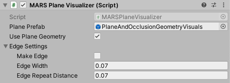
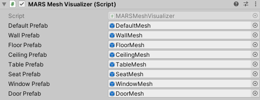

# Visualizers reference guide
Visualizers lets you preview data that is being scanned as you detect your environment; you can use these components to visually see said data.

## Plane visualizer (`MARSPlaneVisualizer`)

Creates planes as you scan your environment to preview the scanned data MARS has gathered.

|**Target Relation**|**Description**|
|---|---|
|**Plane Prefab**|Prefab to instantiate when creating planes.|
|**Use Plane Geometry**|If checked, the planes will match the geometry of the scanned environment; Unchecked will generate square planes.|
|**Make Edge**|If checked, displays an outline of the generated plane.|
|**Edge Width**|Defines the edge thickness of the scanned polygon.|
|**Edge Repeat Distance**|Refers to the repeat distance for the edge texture UVs.|

## Point cloud visualizer (`MARSPointCloudVisualizer`)

Visualizes scanned data through a point cloud and displays each point confidence through colors within a gradient.

|**Target Relation**|**Description**|
|---|---|
|**Low Confidence Color**|Defines the color for the low confidence points in the gradient.|
|**High confidence Color**|Defines the color for the high confidence points in the gradient.|

## Face landmark visualizer (`MRFaceLandmarkVisualizer`)

Visualizes landmarks on a face mask.

|**Target Relation**|**Description**|
|---|---|
|**Scale**|Scale of the landmarks that are being displayed (in centimeters).|

## Light estimation visualizer (`MARSLightEstimationVisualizer`)

Shades your 3D content according to the light direction gathered from the environment.
The Light Estimation Visualizer is an IUsesLightEstimation that if added to a light in the scene will use it do drive the light values from MARS, so you can light AR content.
The light can be directional or ambient depending on device capabilities.

## Mesh visualizer (`MARSMeshVisualizer`)

Creates meshes as you scan your environment.  If your mesh provider also provides mesh classification then different prefabs can be used for different classes of meshes, otherwise all meshes will use the default prefab.  By using an occlusion material meshes can be used to occlude other content without being visible themselves.
