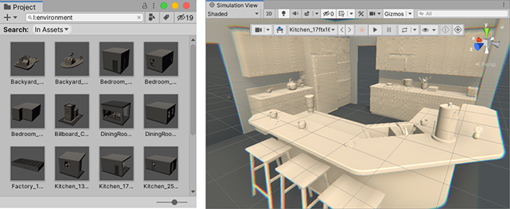
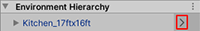
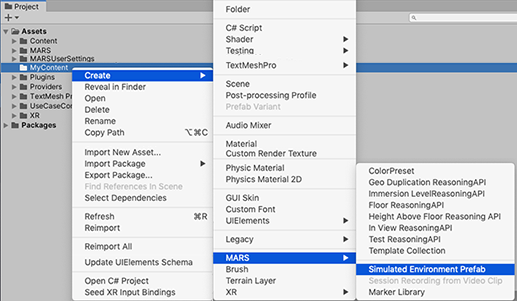
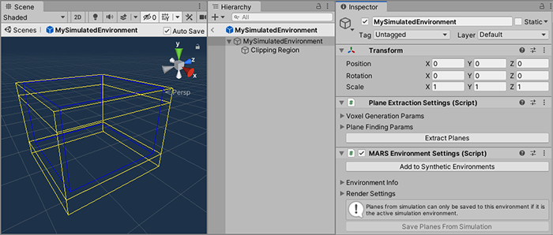
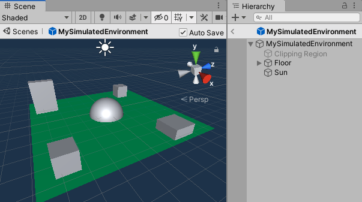
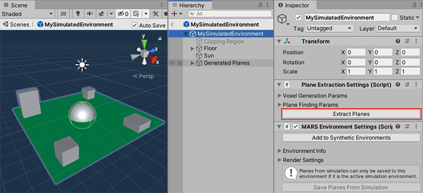
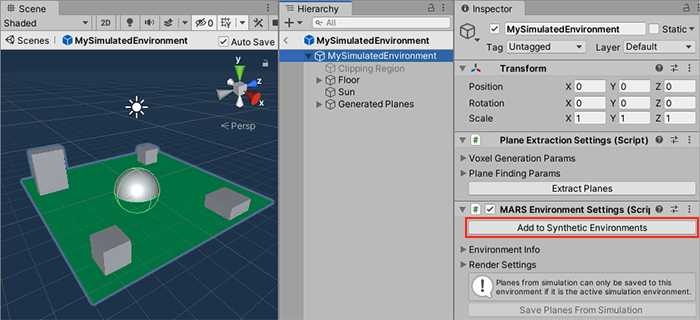

# Simulation environments

Simulation environments are prefabs that act as snapshots of the real world. In the [Simulation view](UIOverview.md#simulation-view), you can preview how your content might react to surfaces and other data your device can detect. 

In this section we will cover: the different parts of any simulated environment, what simulated environments are for, a quick demonstration on how to create a simple environment, and how to test your new simulated environment.

# Searching available environments
Unity MARS generates the list of simulation environments it uses from prefabs in the Project which are tagged with the 'Environment' asset label. To see all of these environments in the Project window, search for `l:Environment`.

# Anatomy of a simulation environment
As mentioned above; simulation environments are prefabs that act as snapshots of the real world. Any simulation environment requires three main things:
1. An `Environment Label` set on the asset prefab
2. A [`MARS Environment Settings`](ReferenceGuideSimulationEnvironmentComponents.md#mars-environment-settings-marsenvironmentsettings) component.
3. A [`Plane Extraction Settings`](ReferenceGuideSimulationEnvironmentComponents.md#plane-extraction-settings-planeextractionsettings) component.

Optionally, if the environment to be simulated is a closed space like an apartment room, a warehouse, or a museum, you can add an [`XRay Region`](ReferenceGuideSimulationEnvironmentComponents.md#x-ray-region-xrayregion) component to facilitate looking through walls when working with the environments, along with [`X Ray Collider`](ReferenceGuideSimulationEnvironmentComponents.md#x-ray-collider-xraycollider) components so one can interact with content inside the environment.

Simulation environments support animated elements (like a spinning fan). Any `PlayableDirectors` that a simulated environment contains will start automatically when used in any Unity MARS simulation view. To prevent these elements from constantly animating outside of temporal simulation (which prevents the Editor from idling), add a `SimulatedPlayable` to the GameObject with the Director. _This is the recommended way to add animated elements to your environments_. As a best practice, use a parent to set an initial offset for animated elements.

It is also possible to create [session recordings](SessionRecordings.md) (recorded walkthroughs) of your environments to automate testing of discovery behavior, and even generate planes from the environment for one shot simulations.

## Generating synthetic planes
When scanning your surroundings, MARS will generate planes; with these planes MARS can place Proxies, align content or make sense of your environment. When working with simulation environments you can simulate scanning data and generate synthetic planes within your environment.

There are two ways to create synthetic planes in any given simulation environment. You can either tell Unity to automatically extract planes from the current environment by automatically raycasting around the environment, or you can make a walkthrough in the environment and scan the planes yourself.

### Extracting planes automatically from the environment
To extract planes automatically from the environment, select the GameObject in your environment that contains the [`Plane Extraction Settings`](ReferenceGuideSimulationEnvironmentComponents.md#plane-extraction-settings-planeextractionsettings) component and press the **Extract planes** button. This will process your environment and generate synthetic planes.

### Saving planes from a simulation walkthrough

**(This is the recommended way to create authoring planes for your environment)**

When inspecting the active simulation environment in prefab mode, you can use the **Save Planes From Simulation** button to replace the environment's generated planes with the current planes in the simulation. This is useful if you want the environment to contain planes that you discovered dynamically in the Simulated Device view, rather than planes created from random raycasting throughout the whole environment (as described below).

To record planes in simulation, follow these steps:

1. Open with a new blank Scene and add a plane visualizer
2. Load your environment in the Simulation view.
3. In the MARS Panel, under the **Environment Hierarchy** drop-down, click on the arrow to the right of the environment. This opens the environment in prefab isolation in your Scene view.

   

4. Start the Device View. From Unity's main menu, go to **Window &gt; MARS &gt; Device View**, then click the Play button in the Device View to start the simulation.
5. Explore the Scene, and look at all the surfaces from natural angles. The plane visualizer displays the geometry of the planes as Unity MARS discovers them.
6. Select the environment root in the hierarchy of prefab isolation (not in the **Environment Hierarchy** in the MARS Panel) and in the `MARSEnvironmentSettings` component, click the **Save Planes From Simulation** button.
7. _Optionally:_ Inspect, clean up, and adjust planes. Planes are SynthesizedObjects under the GeneratedPlanes root. These objects have scene picking disabled by default.
8. Save your prefab.

## Simulated meshing
Simulated environments can be used to provide a snapshot of mesh data, which is generated by combining meshes from Mesh Filters in the environment. The [`Simulated Mesh Classification`](ReferenceGuideSimulationEnvironmentComponents.md#simulated-mesh-classification-simulatedmeshclassification) component marks an object and its children with a classification type. For each unique classification type specified in the environment, the simulation generates one or more meshes from objects marked with that classification. The simulation also provides meshes without a classification type from objects that do not have a `Simulated Mesh Classification` component in their parent hierarchy.

If the environment contains an [`XRay Region`](ReferenceGuideSimulationEnvironmentComponents.md#x-ray-region-xrayregion) component, the simulated meshes will not include outward-facing exterior triangles from environment meshes that are rendered with the `MARS/Room X-Ray` shader. If a triangle lies outside the interior bounds defined by the environment's `XRay Region` and faces away from the interior bounds, then it is excluded. To turn off this behavior, go to **Edit** > **Project Settings** > **MARS** > **Simulation** and disable **Exclude Exterior X Ray Geometry** under the **Simulated Meshing** section.

Continuous discovery of meshes is not yet supported.

# Creating a simulated environment
After reading this section you should be able to create simulation environments, set them up, and walk through the created environment in the simulation view.

## Adding a new simulation environment to MARS
1. Right-click in the **Project** view, then select **Create &gt; MARS &gt; Simulated Environment Prefab**.

2. Double click on the created Prefab to open the generated environment and _disable the Clipping Region GameObject_ (containing the [`XRay Region`](ReferenceGuideSimulationEnvironmentComponents.md#x-ray-region-xrayregion)) object if you are not going to have walls that might occlude the environment when seen from outside.

3. Add Content to the environment: a floor, some structures, etc.

4. Extract planes by selecting the environment root and clicking the **Extract Planes** button in the `PlaneExtractionSettings` component.

5. Press the **Add to Synthetic Environments** button in the `MARSEnvironmentSettings` component. (If the button is disabled, that means that the environment is already loaded and ready for use).

Alternatively, if you want to set up an environment prefab from scratch, follow these steps:
1. Lay out the prefab as desired.
2. Add a [`MARS Environment Settings`](ReferenceGuideSimulationEnvironmentComponents.md#mars-environment-settings-marsenvironmentsettings) and [`Plane Extraction Settings`](ReferenceGuideSimulationEnvironmentComponents.md#plane-extraction-settings-planeextractionsettings) components on the root of the prefab.
3. Assign the 'Environment' asset label to the prefab. You can do this manually or click the **Add to Synthetic Environments** button to add the asset label and update simulation environments.
4. To see your environment in the Simulation view, from Unity's main menu, go to **Window &gt; MARS &gt; Developer &gt; Update Simulation Environments**. This is only necessary if you did not use the **Add to Synthetic Environments** button in the previous step.

## Testing the created simulation environment
By now you should be able to navigate in your authored environment. To do this,
start the Device View. From Unity's main menu, go to **Window &gt; MARS &gt; Device View**, to open the device view window.

Find the new environment in the envinronments dropdown in the Simulation toolbar. It will be under a subheader named after the folder containing the prefab. Click the Play button in the Device View to start the simulation.

Explore the Scene, and look at all the surfaces from natural angles. If your scene contains a _plane visualizer_, it will display the geometry of the planes as Unity MARS discovers them.

