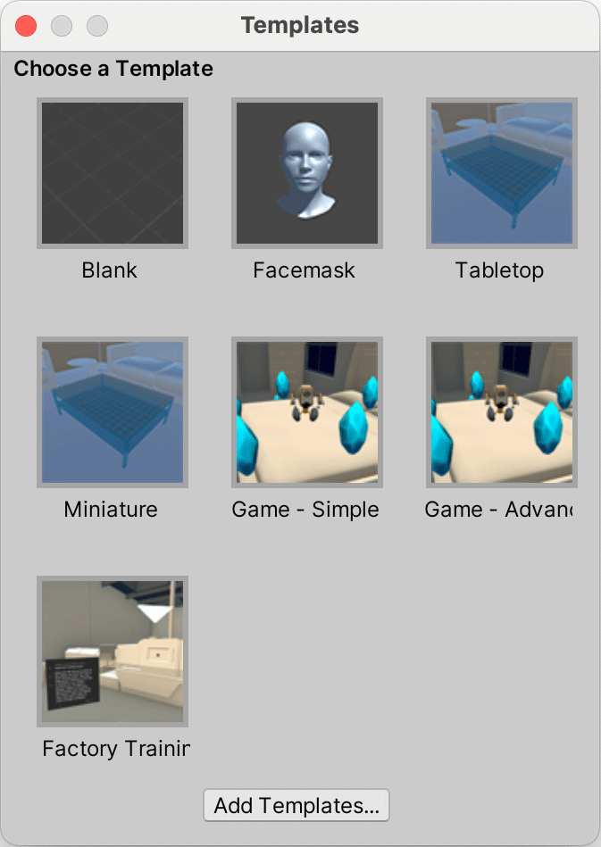
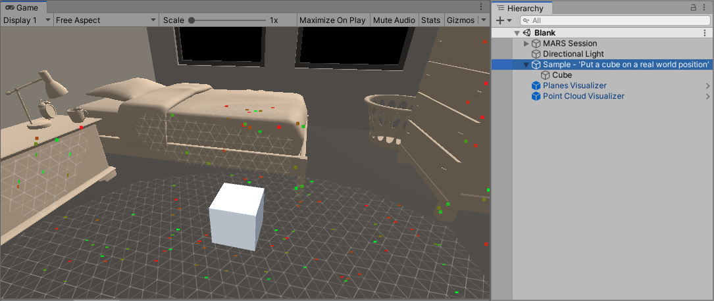
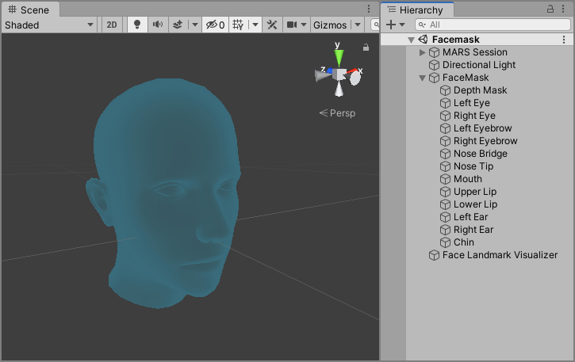
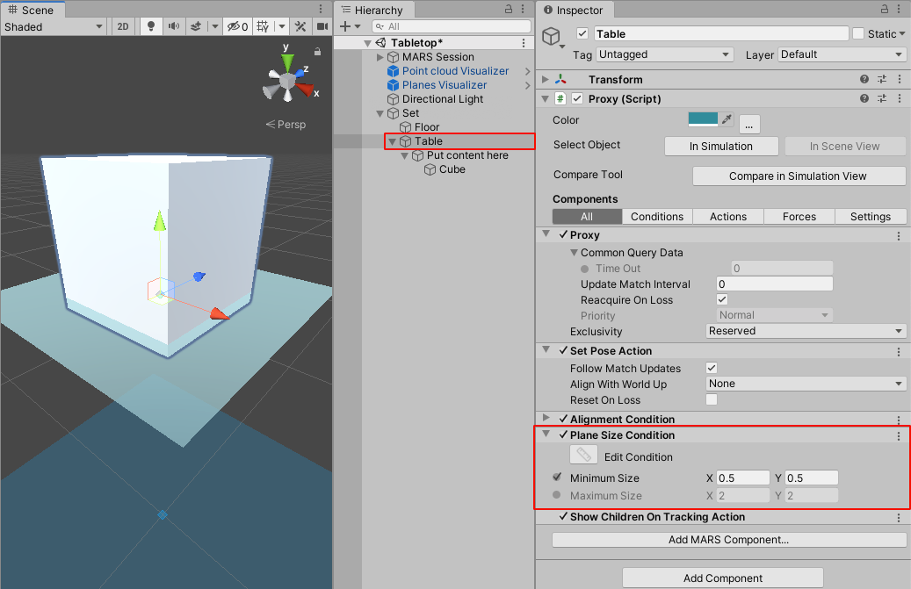
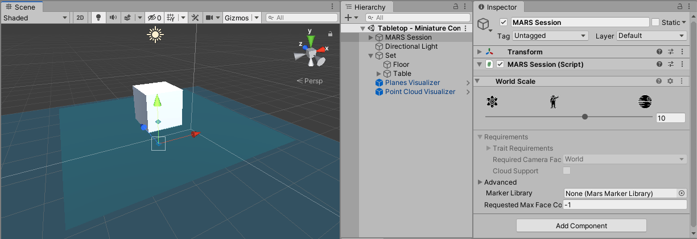
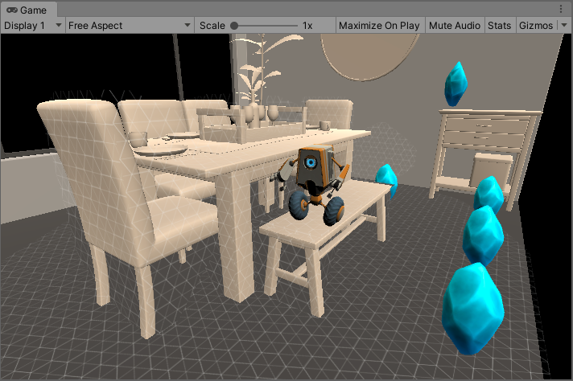
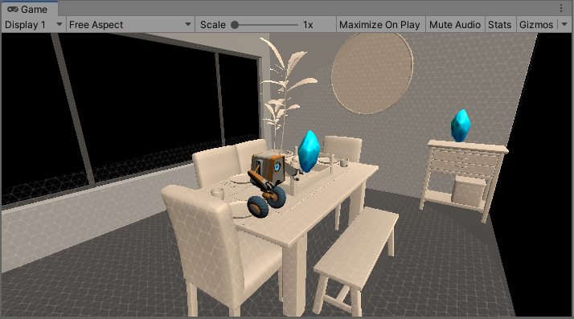
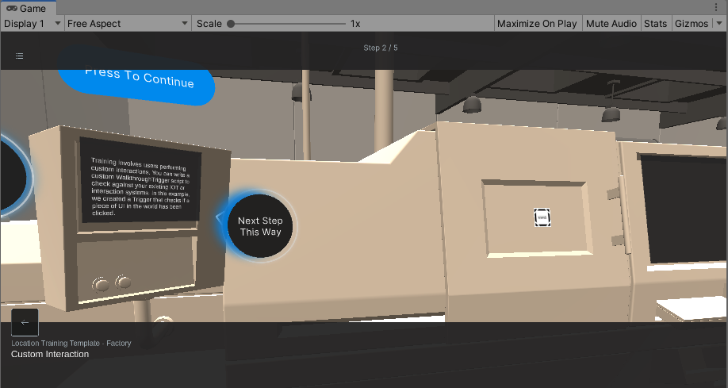
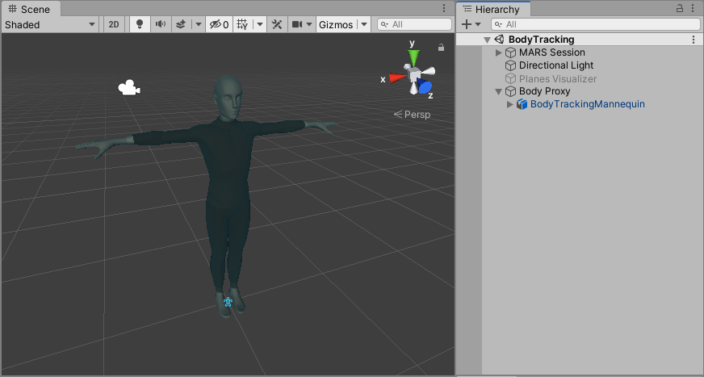

# MARS Templates
Templates are pre-built scenes that can get you kickstarted when creating common types of AR applications. They address certain behaviors like face tracking, body tracking, using image markers, etc.

From Unity's main menu, go to **Window &gt; MARS &gt; Choose Template**. This will display the **Templates** window where you can select a scene template.

Upon selecting one of the available starting templates, a template Scene with all the elements you need for the selected behavior will be opened.

**_NOTE:_** In Unity 2020 and later, the MARS templates window is not available and you can instead access these templates from the official [Unity Scene Templates](https://docs.unity3d.com/Manual/scene-templates.html). The Scene Templates Window appears when creating a new scene with **File &gt; New Scene**.

In this section we will cover the different templates available in Unity MARS:

* [Blank template](#blank-template)
* [Facemask template](#facemask-template)
* [Tabletop template](#tabletop-template)
* [Miniature template](#miniature-template)  
* [Simple game template](#simple-game-template)
* [Advanced game template](#advanced-game-template)
* [Factory training template](#factory-training-template)
* [Body template](#body-template)

# Blank template
The *Blank* template visualizes the planes and point cloud data as they are scanned. It also places a cube in the environment on the first detected plane.

To open the blank template scene go to **Window &gt; MARS &gt; Choose Template** and select the **Blank** button.

If you want to change the cube, replace the GameObject **Cube** with your own GameObject asset.
To be able to visualize what parts of the environment the MARS application has scanned, Unity MARS uses [**Visualizers**](ReferenceGuideVisualizers.md). The blank template comes with two visualizers: a [Point Cloud Visualizer](ReferenceGuideVisualizers.md#point-cloud-visualizer-marspointcloudvisualizer) and a [Planes Visualizer](ReferenceGuideVisualizers.md#plane-visualizer-marsplanevisualizer).

# Facemask template
The facemask template scene lets you create interactions with faces. This scene focuses only on face tracking workflows for anchoring virtual content.

To open the Facemask Template Scene go to **Window &gt; MARS &gt; Choose Template** and press the **Facemask** button.

For a detailed walkthrough on face tracking, please reference the [Face tracking section](FaceTracking.md).

# Tabletop Template
The tabletop scene lets you place content (a cube) on a raised horizontal surface that has a 0.5m by 0.5m size or larger.

To open the Tabletop Template Scene go to **Window &gt; MARS &gt; Choose Template** and press the **Tabletop** button.

In the **Hierarchy window**, find the **Set** GameObject. This is a **Proxy Group** with a Elevation Relation condition representing the height above floor for the **Table** GameObject. This GameObject is a child of **Set** and is the Proxy that holds your content. The Proxy is made up of conditions to match it to a *Plane* 0.5m by 0.5m in size or larger and with an *Alignment* of *Horizontal Up*. When your app finds matching data in the real world, any GameObjects listed as children of the Table Proxy GameObject become active.

By default, a cube is set to appear on the surface. You can remove it and replace it with your own content.

You can put a Prefab directly under this object in the Hierarchy, or drag a Prefab onto the plane in your Scene. The plane is an abstract representation of the Table element mentioned above. Any local position offset your GameObject has from the center of the Table element remains in absolute units, and not as a percentage of the offset value relative to the size of the real-world surface.

**Note:** Most AR devices don't support object recognition yet. There might be flat surfaces that register as appropriate for tabletop content, but which aren't tables, such as couches or chairs. You can test your app in **Simulation Mode** (menu: **Window &gt; MARS &gt; Simulation View**) to see how it will behave with real-world data, and how you can tweak your conditions to get a better fit.

# Miniature template
The **Miniature** template is the same as the **Tabletop** template presented above, but with the [**World Scale**](WorkingWithMARS.md#scaling-ar-content-with-world-scale) changed to make your content appear 10 times smaller compared to the real-world.

To open the Miniature Template Scene go to **Window &gt; MARS &gt; Choose Template** and press the **Miniature** button.

The scale for augmented content in MARS is modified in the **MARS Session** GameObject. By changing the World Scale by 10x the augmented content will be 10 times smaller when placed in the real-world.  However, unlike simply scaling down your content, this approach maintains correct scaled-down behavior of lighting, physics, and other scale-dependent behavior.

For further reading on how to work with scale in AR please reference [dealing with scale in AR](https://blogs.unity3d.com/2017/11/16/dealing-with-scale-in-ar/) post.

# Simple game template
The simple game template is an example of a quick way to prototype an AR experience. This example relies heavily on just culling things out scanned planes and nothing else.

To open the Game - Simple Template Scene go to **Window &gt; MARS &gt; Choose Template** and press the **Game - Simple** button.

# Advanced game template
The advanced game template uses [forces](Forces.md) and [synthetic data](ReferenceGuideSyntheticData.md) to ensure data is not overlapping and can fit in more areas gracefully. This template shows how a more robust production version of the "Simple game template" experience can be set up.

To open the Game - Advanced Template Scene go to **Window &gt; MARS &gt; Choose Template** and press the **Game - Advanced** button.

# Factory training template
The factory training template uses [Image markers](Markers.md) placed in a real-world environment that serve as anchors to create augmented training content, to guide the application users on how to perform a given task.

To open the Factory Training Template Scene go to **Window &gt; MARS &gt; Choose Template** and press the **Factory Training** button.

# Body template
The body tracking template has an avatar (BodyTrackingMannequin GameObject) that will match the movement of a person on camera in AR.

To open the Body Tracking Template Scene go to **Window &gt; MARS &gt; Choose Template** and press the **Body Tracking** button.

For more information about body tracking, please see the [Body Tracking](BodyTracking.md) page.

**_Note:_** Body Tracking is currently only supported on compatible iOS devices.
