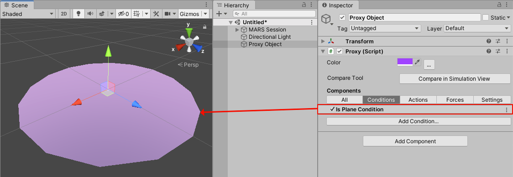
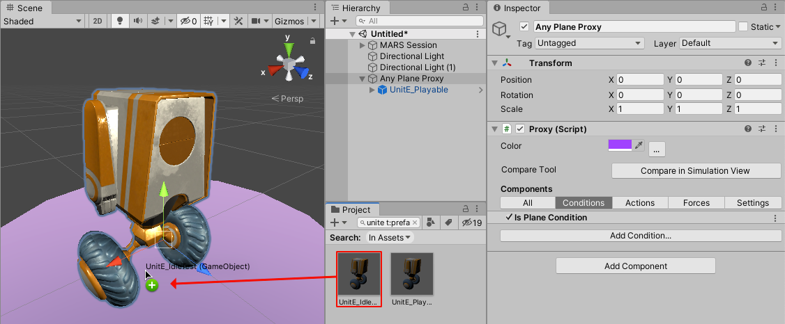
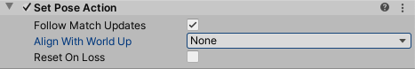
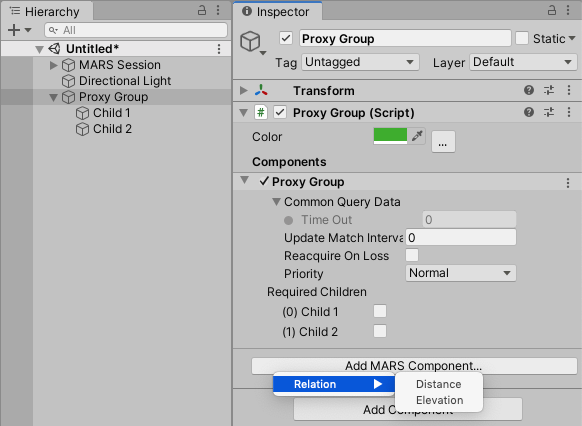
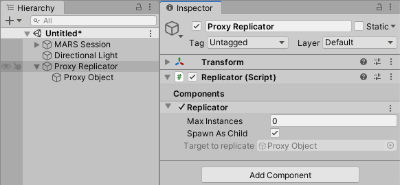
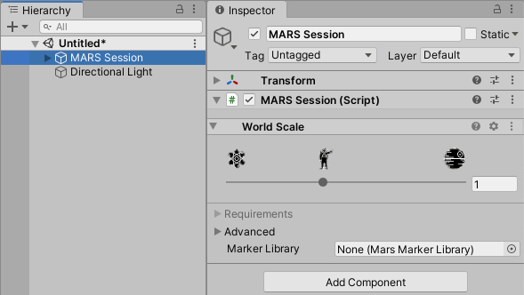
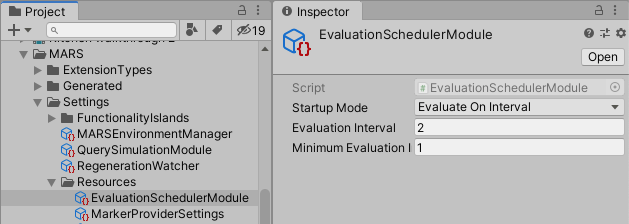

# Working with Unity MARS

There are two approaches you can follow when creating Unity MARS apps: The Rules workflow and the GameObject workflow. Each has its own advantages.

The Rules workflow describes an AR layout and behavior concisely in plain language. With this approach you provide a description of the expected real-world environment and the AR content to populate the environment. For example, "On every horizontal surface, create grass", or "On an image marker, show UI".
The Rules workflow is designed to guide you through setting up your AR content. This workflow includes configuring Proxies, Replicators, Proxy Groups, etc. For a full walkthrough of using Rules in Unity MARS, please reference the [Rules documentation section](Rules.md).

On the other hand, with the GameObject workflow, you'll create and manage GameObjects for Proxies, parent their appropriate augmented content, and depending on the app requirements, parent said Proxies to Replicators, etc. This approach is more manual than the Rules workflow, but can provide greater flexibility if your app requires an uncommon Proxy setup.

This section will focus on how to create content through the GameObject workflow.

This page starts by providing some tips for authoring AR content with Unity MARS, then it covers the basics of working with [Proxies](Glossary.md#proxy), [Proxy Groups](Glossary.md#proxy-group), and [Replicators](Glossary.md#replicator). We will then cover how to use scale in AR and how to control when Unity MARS evaluates your scenes.

This page covers the following Unity MARS workflows:
* [Tips for authoring AR content with Unity MARS](#tips-for-authoring-ar-content-with-unity-mars)
* [Creating a proxy](#creating-a-proxy)
    * [Attaching content to a proxy](#attaching-content-to-a-proxy)
    * [Aligning content to a proxy](#aligning-content-to-a-proxy)
    * [Creating a Proxy automatically from simulated data (Create Tool)](#creating-a-proxy-automatically-from-simulated-data-create-tool)
    * [Debugging a Proxy against simulation data (Compare Tool)](#debugging-a-proxy-against-simulation-data-compare-tool)
    * [Using synthetic data to place content](#using-synthetic-data-to-place-content)
* [Creating proxy groups](#creating-proxy-groups)
* [Using a replicator to place content on multiple surfaces](#using-a-replicator-to-place-content-on-multiple-surfaces)
* [Scaling AR content with World Scale](#scaling-ar-content-with-world-scale)
* [Scene evaluation](#scene-evaluation)

# Tips for authoring AR content with Unity MARS

1. You might like to think of surfaces matching the axes that you see in the Simulation View, but in the real world you can't count on strict orientations. For example, scanning a rectangular table will very rarely result in a surface with its edges aligned on the X and Z axes. In general, planes coming from AR devices have fairly random rotations, especially for surfaces that are not rectangles.

2. It's usually better to make content that can adapt to the world, rather than limit situations where your content can be used. Making your content adaptable is the best way to ensure that it works.

3. AR is unpredictable. Include contingencies and fallbacks for any critical features of your app.

4. It’s usually best to leave room scanning and debug visualizations on, at least until you have placed content. Visualizers, and on-screen instructions to move around the space, help users understand that your app is still working and needs to see more of the space.

5. Synthetic data offers a way for you to build up an AR experience in layers. For example, it's often better to author Synthetic ‘spawn points’ on your environments rather than placing critical content on them directly. This way, you can author conditions that, for example, look for the spawn point that's closest to the user. For more information, see [Using synthetic data to place content](#using-synthetic-data-to-place-content).

# Creating a Proxy

To create a proxy, from Unity's main menu, go to **GameObject &gt; MARS &gt; Proxy**. This creates an empty Proxy in the Scene.

A new (empty) Proxy contains a few default Actions and Conditions. It expects the data it matches to have a position and orientation, then shows or hides its child GameObjects based on whether it has found a match. To make the Proxy match any type of Plane, add a new condition to it. Click the **Add MARS Component** button in the Inspector, then select **Condition &gt; Trait &gt; Plane**.



The Proxy now matches against any single surface found in the world.

## Attaching content to a Proxy

In the **Hierarchy** view, you can drag and drop Prefabs, meshes, or Assets as child GameObjects of the Proxy you created. When you drag a GameObject over a Proxy visualization, the visualization is highlighted and a tooltip with its name appears. When you release the GameObject, Unity MARS adds the Asset as a child of the Proxy in the **Hierarchy** view.



**Note:** MARS retains the Asset's local position offset. If you want the Asset to appear in the center of the detected surface, set its local position to (0, 0, 0).

## Aligning content to a proxy

When a Proxy finds a match, the Set Pose Action moves its Transform's position and rotation to align with the data's pose.

If the match data is a vertical plane, it might be useful to enable the **Align with World Up** option to make the content have a consistent vertical orientation. The option has three different modes:

* None: (Default) The Proxy directly matches the data's pose. The rotation of the pose data depends on the data provider.
* Y: The Proxy's local Y axis (Up) is always be aligned to the world's Up direction.
* Z: The Proxy's local Z axis (Forward) is always aligned to the world's Up direction.



When the mode is set to align either Y or Z to Up, the other axis is always perpendicular to the world's Up and aligned towards the data's Up. If the data's Up direction is parallel to the world Up, then it falls back to the data's Forward.

## Creating a Proxy automatically from simulated data (Create Tool)

The Create Tool allows you to drag and drop a Prefab onto any data in **Simulation View** and automatically create Proxies with Conditions that describe the sampled data.

For more information, see the [Create Tool documentation](CreateTool.md).

## Debugging a Proxy against simulation data (Compare Tool)

The Compare Tool allows you to debug why a Proxy is or is not matching a given piece of data (a surface, image marker, etc) in the **Simulation View**.

For more information, see the [Compare Tool documentation](CompareTool.md).

## Using synthetic data to place content

We covered how to [attach a GameObject to a Proxy](#attaching-content-to-the-proxy) that matched your criteria. Synthetic data offers additional flexibility, such as comparing Proxies against one another. Based on queries, Unity MARS creates synthetic data that goes back into the database. You can query against a synthetic data semantic tag, and add more conditions to it.

For example, if you're making an AR game, you can define some base conditions for placing enemies using Replicators, but you might want a weaker version of the enemy to spawn near the player character's spawn point. If you add *player_spawn* and *enemy_spawn* semantic tags to the hero Replicator and enemy Replicator synthetic data, you can also add distance conditions on the Replicators that determine whether a weaker enemy spawns or not.

# Creating Proxy Groups

The previous sections described how to work on a single Proxy - that is, a single collection of real-world traits. Unity MARS also offers a feature called Proxy Groups, which allow you to relate multiple Proxies together.

Proxy Groups follow the same pattern as individual Proxies. They contain Relations to address or locate them and actions to invoke scripts when a Proxy Group is matched or updated. The difference is that Relation scripts refer to multiple Proxies rather than a single one.

Proxy Groups have the following structure:

```
GameObject (ProxyGroup) (Relation)
   -Child GameObject (Proxy) (Condition)
   -Child GameObject (Proxy) (Condition)
    -...
```

The list of child GameObjects that are available to this Proxy Group displays in the group's Inspector. To indicate that Unity MARS requires a child GameObject, check the box next to it in the **Required Children** list. MARS uses child GameObjects that aren't required to find the Proxy Group. Once that happens, the Proxy Group doesn't lose its data even if these child GameObjects are lost or removed.

There are three ways to create a Proxy Group:

* Click the **Proxy Group** button on the MARS Panel
* From Unity's main menu, go to **GameObject &gt; MARS &gt; Proxy Group**.
* Add a ProxyGroup component to a new GameObject.

All of these methods create a GameObject with a Proxy Group and two Proxy child GameObjects. To add a Relation, click the **Add MARS Component** button in the Proxy Group's Inspector, then select **Relation** and choose a Relation type from the menu.



You can also place Proxy Groups inside Replicators. This creates as many instances of that Proxy Group as there are matches.

# Using a Replicator to place content on multiple surfaces

Each Proxy represents exactly one match with real-world data. However, you can also spawn content on every match of a query. For example, you might want to spawn a grassy ground on every horizontal plane your app detects. For this, you can use a Replicator.

To use a Replicator, follow these steps:

1. Create a Proxy, following the method outlined in the [**Creating a Proxy**](WorkingWothMARS.md#creating-a-proxy) section above.

2. Create a Replicator GameObject: click the **Replicator** button in the **MARS Panel**, or from Unity's main menu go to **GameObject &gt; MARS &gt; Replicator**.

3. Select the GameObject. In its Inspector window, you can set how many instances of a match your app supports in the **Max Instances** property, and whether they should be created as children of the Replicator or as siblings of it by enabling or disabling the **Spawn As Child** property. A value of 0 for **Max Instances** indicates no limit on the number of instances.

4. Move your Proxy to be a child of the Replicator.



# Scaling AR content with World Scale

Due to floating point precision, the Unity Editor works best on a real-world object scale, where 1 unit = 1 meter. Scaling your content to achieve “world-in-miniature” behavior doesn't account for effects such as gravity, lighting, physics, AI, and so on. These systems still operate on a normal scale.



Unity MARS uses a concept called World Scale that allows you to develop content at real-world scale, and display it at a miniature scale. You can adjust the World Scale for the current Scene in the **MARS Session** Inspector. In general, MARS uses a scale of 1:1 for life-sized AR and 1:10 for tabletop miniatures.

**_Note:_** Unity MARS currently doesn't support a combination of miniature scaled and real-world scaled GameObjects.

To achieve the World Scale effect, leave GameObjects at their “real” size and instead modify the camera offset so that physical systems (such as physics, particles, and lighting) continue to work as expected. For more information, see [Dealing With Scale in AR](https://blogs.unity3d.com/2017/11/16/dealing-with-scale-in-ar/) on the Unity blog, and Unity's [AR Lightning Talks at GDC](https://www.youtube.com/watch?v=VP1BkhvcWs4&feature=youtu.be&t=37).

# Scene evaluation

Finally, it's important to mention how Unity MARS evaluates proxy matches. There are two ways to control how MARS evaluates the matches for your Scene. Depending on your application needs, you might want to select one or the other. To select which mode MARS starts with, go to **Edit &gt; Project Settings &gt; MARS &gt; Runtime**, and set the **Startup Mode** option:

* **EvaluateOnInterval**: By default, MARS attempts to solve your scene on a fixed time interval, which you can specify with the **Evaluation Interval** field.
* **WaitForRequest**: In this mode, MARS does not evaluate matches for your Scene until it receives a request to do so.



The **Minimum Evaluation Time** field controls the minimum time that has to elapse between evaluations. Use it to prevent your app from spamming evaluation requests that would result in running Scene evaluation every frame. Set this field to 0 to not enforce any time between evaluations.
